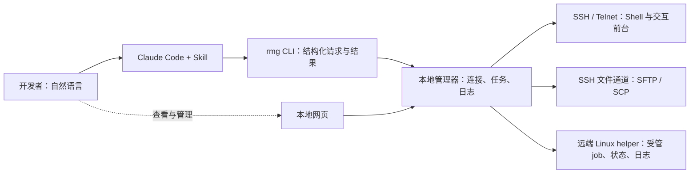

# remote-mng

**让 Agent 可靠地操作远程设备，让开发者看清执行过程和结果。**

在本地向 **Claude Code 终端 CLI** 描述需求，由它调用 remote-mng 完成远程连接、传包、部署、交互调试和长任务查询。开发者通过自然语言安排工作，通过本地网页查看设备、任务、日志和待处理事项；日常 CLI 参数交给 Agent。

工具随包提供 Claude Code Skill，主入口是 `rmg` CLI。Skill 告诉 Agent 如何检查条件、记录步骤、保存任务 ID，以及如何处理断线和结果不明。MCP 保留为可选适配层，默认使用不需要配置 MCP。remote-mng 本身不内置模型，也不替代项目的构建脚本和业务验证规则。

当前代码版本 **0.4.0，个人试用阶段**。仓库暂为私有，源码和 Release 都需要 GitHub 访问权限。正式发行以 [Releases](https://github.com/LX-Cel/remote-mng/releases) 中的资产和验证记录为准。0.4 的正式发布门槛包含 Windows、Linux 构建及对应更新验收；存在 tag、能下载 Actions 制品或本地测试通过，都不等于正式发行已完成。若发行标记为预发布，应先阅读其中列出的平台限制。

## 它解决什么问题

| 场景 | 工具提供的支持 |
| --- | --- |
| Agent 每次都要重新摸索连接方式 | 保存 SSH/Telnet 目标、认证引用、提示符和传包入口；执行前诊断并报告失败阶段 |
| 上传、部署、验证混在长对话里 | 持久任务档案记录产物摘要、稳定步骤 ID、操作与作业 ID、时间线和结果证据 |
| 网络断开后不知道长任务是否完成 | Linux helper 在远端保存受管作业状态、退出码和日志，重连后查询原 job ID |
| 交互命令超时，Agent 容易重复发送 | 将一次输入与请求 ID 关联，超时后继续观察原请求；不因未等到提示符自动重发 |
| 批量传文件失败后需要恢复 | SFTP 目录清单、SHA-256 验证、冲突策略和文件级恢复；提供遗留 SCP 兼容路径 |
| 开发者不知道 Agent 卡在哪 | 本地控制台集中显示设备、步骤、会话、日志、待确认事项及适用的管理操作 |
| 经常迭代，程序和 Skill 容易不同步 | 统一更新入口固定版本和摘要，保留更新记录，核对组件状态，提供兼容回退和失败恢复 |

例如，“文件已上传”“Shell 退出码为 0”“测试输出符合成功规则”是三种不同证据。remote-mng 保留这些证据，不把提示符出现或连接断开自动判定成业务成功。重复提交保护只覆盖对应的受管步骤和请求，不能保证任意业务命令天然幂等。

## 一次安装，之后用自然语言

### 推荐：独立发行包

独立包包含 Python、依赖、网页、Skill 和 helper 脚本，不要求开发者安装 Python。支持的发行平台为 **Windows x86_64、Linux x86_64**；WSL 使用 Linux 包，并与 Windows 分别安装。Windows 原生 Claude Code 需要可用的 Git Bash。Linux 包需要满足发布清单中的 glibc 要求，正式 CI 使用 Ubuntu 22.04 构建；macOS、ARM 和其他环境尚未作为发行平台承诺。

在普通系统终端完成首次安装。先准备 [GitHub CLI](https://cli.github.com/)，使用有仓库权限的账号认证：

```sh
gh auth login
gh auth status
```

也可以登录 GitHub 网页后从 Release 手动下载。以下以 **v0.4.0** 为例，先确认该 Release 已发布并包含对应资产，若为预发布则核对其限制。私有仓库不能使用匿名下载链接；GitHub 权限与目标设备的 SSH 认证是两套独立配置。

**Windows PowerShell**：下载固定版本的 ZIP、安装脚本及各自摘要。

```powershell
gh release download v0.4.0 --repo LX-Cel/remote-mng --dir ./rmg-install `
  --pattern 'remote-mng-0.4.0-windows-x86_64.zip*' `
  --pattern 'install-release.ps1*'
Set-Location ./rmg-install
```

阅读下载的 `install-release.ps1` 后，校验脚本并安装：

```powershell
$installerSha = ((Get-Content -Raw ./install-release.ps1.sha256).Trim() -split '\s+')[0]
if ((Get-FileHash ./install-release.ps1 -Algorithm SHA256).Hash -ne $installerSha) {
  throw '安装脚本摘要不匹配'
}
$archiveSha = ((Get-Content -Raw ./remote-mng-0.4.0-windows-x86_64.zip.sha256).Trim() -split '\s+')[0]
./install-release.ps1 -Archive ./remote-mng-0.4.0-windows-x86_64.zip -Sha256 $archiveSha
```

**Linux / WSL**：需要已有 `unzip` 和 `sha256sum`。

```sh
gh release download v0.4.0 --repo LX-Cel/remote-mng --dir ./rmg-install \
  --pattern 'remote-mng-0.4.0-linux-x86_64.zip*' \
  --pattern 'install-release.sh*'
cd ./rmg-install
```

阅读下载的 `install-release.sh` 后，校验脚本并安装：

```sh
sha256sum --check install-release.sh.sha256 && \
  sh ./install-release.sh ./remote-mng-0.4.0-linux-x86_64.zip \
  "$(cut -d ' ' -f 1 ./remote-mng-0.4.0-linux-x86_64.zip.sha256)"
```

安装脚本先验证 ZIP 摘要，安装器再核对逐文件清单和运行条件。成功后安装工具、绑定个人 Skill 并启动本地管理器。默认安装目录为 Windows `%LOCALAPPDATA%/remote-mng` 或 Linux `~/.local/share/remote-mng`；不会修改全局 PATH。Agent 使用 Skill 中已绑定的稳定入口，因此不依赖你手工添加 PATH。完整参数和离线安装见 [独立包安装指南](docs/distribution.md)。

### 备选：uv 安装

适合愿意维护 Python 工具环境、或需要从源码安装的开发者。准备 Python 3.11+、Git 和 [uv](https://docs.astral.sh/uv/getting-started/installation/)，在已认证且有访问权限的终端中执行：

```sh
gh repo clone LX-Cel/remote-mng
cd remote-mng
git checkout v0.4.0
uv tool install .
rmg setup --start-daemon
```

这里使用固定发布 tag，避免无意安装仍在变化的开发分支。若 uv 提示工具目录不在 PATH，按提示执行 `uv tool update-shell`、重开终端，再执行 `rmg setup --start-daemon`。`setup` 安装 Skill、启动本地管理器并检查本地状态，不连接远端。普通 uv tool 安装可使用后续统一更新；可编辑开发环境和未知 pip 安装不会被自动覆盖。当前不通过 PyPI 包名安装。更多说明见 [Skill 安装与维护](docs/claude-skill.md)。

### 开始第一次任务

安装完成后，在业务项目目录开启**新的 Claude Code 会话**，让它加载已安装的 Skill。个人 Skill 默认位于 `~/.claude/skills/remote-mng/`，设置了 `CLAUDE_CONFIG_DIR` 时使用该配置目录。它可供同一环境下的多个业务项目使用。Skill 加载机制见 [Claude Code 官方说明](https://code.claude.com/docs/en/skills)。

先从本地检查开始：

> 使用 remote-mng，检查本地安装和已经配置的设备，打开状态控制台，告诉我有哪些条件尚未满足。

首次添加设备时，提供目标别名、地址和端口、用户名、密钥文件路径或口令环境变量名，并按 [连接指南](docs/transports.md) 核验 SSH 主机密钥。不要在对话中粘贴密码或私钥内容。传包路径、部署脚本和成功规则由你的项目提供。

配置完成后，可以这样安排任务：

> 使用 remote-mng 管理这次部署。先运行项目中的构建脚本，把 build/package.tar.gz 上传到 lab 的 /tmp/package.tar.gz，按 scripts/deploy-and-check.sh 部署和验证。建立任务记录，保存产物摘要和作业 ID；如果断线或结果不明，先查询原任务。打开网页让我查看进度。

或者检查已有长任务：

> 查询上次部署任务的原 job ID，读取新增日志，告诉我已确认的结果和还不确定的部分，不重新提交部署。

也可以用 `/remote-mng` 显式调用 Skill。交互前台需要提供真实的进入命令、提示符、退出方式及成功判据；工具不内置 CTP 或某个厂商的专用命令。可复制 [项目配方模板](examples/rmg-project.json) 保存本项目流程，再按 [个人试用指南](docs/personal-trial.md) 逐步验证。

## 开发者怎样查看状态

直接告诉 Claude：“打开 remote-mng 控制台。”Agent 调用 `rmg ui`，网页展示设备检查、个人任务、步骤证据、会话与操作、日志，以及组件版本和更新历史。远端检查和任务刷新由明确操作触发，不把本地缓存当作实时远端状态。

独立包还提供固定入口：Windows 双击安装目录的 `bin/Open remote-mng.cmd`；Linux / WSL 使用 `bin/open-console.sh`。电脑重启后也可从这里启动管理器并打开页面。网页与本地 RPC 只监听 loopback，访问链接包含本机访问凭证，不应分享到公共文档。

网页是个人状态和管理入口，不是完整终端模拟器。当前不提供团队账号、多人协作调度或远程开放的管理后台。

## 原理与远端 helper



本地管理器持有连接并保存任务档案。普通 CLI 调用结束后，管理器仍可继续观察已提交操作。远端长任务的持久性则由 **Linux helper** 提供：它将作业与登录连接分离，把状态和日志写入远端目录，断开本地连接后仍可按原 ID 查询。

helper 是随客户端分发的轻量 Shell 脚本，通过已配置的 SSH 或具备 POSIX Shell 的 Telnet 通道安装到可写目录，默认 `~/.local/share/remote-mng`；不要求远端安装 Python。需要 Linux `/proc`、`setsid` 和探测通过的基础命令。Agent 在已授权目标确实需要受管长任务时安装或更新 helper，普通终端和文件传输不要求它。详见 [helper 存储与维护](docs/helper-storage-v03.md)。

## 更新、回退与个人约定

对 Claude 说：

> 检查 remote-mng 是否有新版，说明更新影响。如果没有阻碍，更新到最新版，保留已有任务，完成后核对程序、管理器和 Skill 版本。

0.4 的统一更新入口先固定发布版本和摘要，再由独立更新进程执行，并保留更新 ID 和进度页。Agent 可以查询组件状态、阻碍、历史和恢复结果。检查阶段不会安装；活动交互会话、正在执行的操作、被修改的托管 Skill 或不支持的安装来源会阻止切换。

独立安装保留兼容版本供回退；受支持的 uv 安装在替换前缓存原程序和依赖，供离线恢复。更新不重新提交远端作业，也不批量更新设备 helper。`failed` 后恢复到旧版不等于升级成功，`blocked` 表示尚有条件未满足。流程、退出码和恢复入口见 [更新指南](docs/updates.md)。

**从 0.3.0 等没有 `update` 命令的版本升级，需要先做一次引导安装。** 让 Agent 检查活动任务并保留 job ID，在普通前台可断开后停止旧管理器，再按对应的独立包安装步骤或 [uv 旧版本升级步骤](docs/claude-skill.md#升级旧版本) 安装 0.4。旧 CLI 不会因为服务端出现新版就自动获得更新命令。完成后新开 Claude 会话，之后再使用统一更新。

个人部署规范可以保存在 `~/.claude/remote-mng/USER.md`，自定义 Claude 配置目录时跟随该目录。安装、升级和卸载都不修改这个文件；不要直接修改托管的 `skills/remote-mng` 目录。已存在的用户修改会被保护并报告冲突，不能靠强制覆盖跳过。

## 平台和执行边界

- **Windows 宿主可能限制独立进程创建。** 首次安装应在允许的普通系统终端完成。更新会在最终执行进程中、停止原管理器和切换版本之前检查独立进程创建能力；受限时报告阻碍并保留原版本和运行中的管理器。预先启动过管理器不能证明更新进程也有相同权限。当前受限 Windows 宿主的验收确认了这一保护行为，不能据此宣称全自动升级和回退成功；也不会通过计划任务、其他宿主或弱化进程独立性绕过限制。
- **普通终端与持久 job 不同。** 普通 SSH/Telnet 前台在网络断开或管理器重启后不能自动重接；历史输出可以保留。需要断线后查询的部署和测试应使用受管 job。远端重启不会自动续跑作业，自行脱离受管进程组的业务进程不能完整跟踪。
- **Telnet 是明文协议，也没有天然文件通道。** 需要已有的网络隔离或加密通道；传包另配 SSH 入口。SSH 支持单层 jump、HTTP CONNECT/SOCKS5 代理和有界登录流程，不承诺任意多跳及所有堡垒机菜单。
- **传输恢复有明确范围。** SFTP 支持 SHA-256 读回验证和目录文件级恢复，会增加读回流量；不支持单文件字节级续传。遗留 SCP 仅支持普通文件，缺少端到端摘要验证，不能假定与系统 `scp` 的默认模式完全相同。
- **日志有保留上限。** 本地和 helper 日志会轮转，旧游标落入缺口时明确报告；不能把缺失历史当作没有发生。目标账户决定实际权限，工具不是 Shell 沙箱。
- **设备适配仍需试用。** 回环协议、通用 Linux 和本地更新验收不代表全部 BusyBox 固件、公司设备、专用前台及认证流程均已兼容。Windows 与 WSL 分别使用自己的路径、凭据、管理器和状态目录。

## 文档入口

| 你想做什么 | 阅读 |
| --- | --- |
| 首次安装与固定版本离线安装 | [独立包安装](docs/distribution.md) · [Claude Skill 接入](docs/claude-skill.md) |
| 跑通第一个业务任务 | [个人试用指南](docs/personal-trial.md) · [项目配方](examples/rmg-project.json) |
| 配置设备、跳板、代理和传包 | [连接基础](docs/transports.md) · [连接与文件恢复](docs/transports-v03.md) |
| 操作交互前台和同一 Shell | [Agent 操作约定](docs/agent-guide.md) · [Shell 命令](docs/shell-v03.md) |
| 管理远端长任务、日志和空间 | [helper 存储与维护](docs/helper-storage-v03.md) |
| 查看更新状态、回退和失败恢复 | [更新指南](docs/updates.md) |
| 了解原理和已验证边界 | [0.4 本地验证快照](docs/v04-validation.md) · [交互原理演示](docs/explainer-v02.html) · [0.3 验证记录](docs/v03-validation.md) |

版本命名的历史文档记录当时的范围，不代表新版验证已完成。Agent 的完整参数可从 `rmg schema --json` 和各命令的 `--help` 获取；`python -m remote_mng` 与 `rmg` 使用同一入口。

## 开发与验证

在源码目录使用锁定依赖，开发环境与日常 uv tool 安装分别维护：

```sh
uv sync --locked
uv run rmg --help
uv run pytest
uv run ruff check .
```

构建独立包：

```sh
uv sync --frozen --group bundle
uv run --frozen python scripts/build_release.py
uv run --frozen python scripts/smoke_release.py --build-result dist/release/build-result.json
```

[发布流水线](.github/workflows/release.yml) 在 Windows 和 Ubuntu 22.04 上执行测试、构建及实际制品验证，核对上一正式版的升级/回退，并运行真实 uv 环境到独立更新器的交接与离线回退。源码前驱夹具使用当前实现加测试版本号，不冒充历史正式版。默认 CI 要求完整更新成功；受限宿主的 `passed_blocked_safely` 专项诊断不能替代发布门槛。0.4 的最终跨平台发行结果以这次正式流水线记录为准，失败时保留诊断制品，不自动发布。

## 许可证

采用 [MIT License](LICENSE)。私有仓库访问仍需单独授权；第三方依赖保留各自许可证，见 [依赖说明](docs/dependencies.md)。
