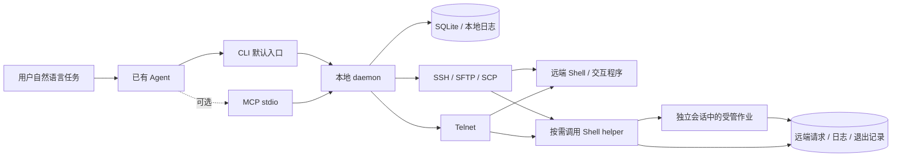

# 模块与恢复语义

`remote-mng` 把连接生命周期、远端程序生命周期和观察结果分别管理。Agent 优先调用 CLI，MCP 作为可选适配，两者调用同一套应用接口。用户通过已有 Agent 提出自然语言任务，不需要记忆本工具命令。退出一次 CLI 调用不会直接销毁由 daemon 持有的会话。

## 实现选择

0.3 延续 Python 3.11+，使用 AsyncSSH、telnetlib3 和官方 MCP SDK，协议代码与应用状态分离；独立发行包包含解释器，源码安装继续可用。具体依赖和许可证见 [依赖说明](dependencies.md)。

| 候选 | 对本项目的主要收益 | 主要代价 | 本版决策 |
| --- | --- | --- | --- |
| Python | 复用已验证的 SSH、Telnet 和 MCP 实现，便于测试协议和进程异常 | 需打包解释器与锁定依赖，体积较大 | 采用，提供目录式独立包 |
| Go | 有利于后续分发单一可执行文件 | 需要重做本版已验证的 Telnet、交互与 MCP 组合 | 保留为后续打包/重写评估，不为首版增加双实现 |
| TypeScript/Node | 适合 MCP 与网页生态 | 切换会增加终端及进程管理验证工作；当前网页可由现有服务提供 | 未采用 |

这是针对本版已验证路径的工程取舍，并非语言性能排名。远端 helper 是随包分发的 Shell 文件，不需要安装本地 Python 依赖。

## 代码职责

| 模块 | 职责 |
| --- | --- |
| `cli.py` / `mcp_server.py` | Agent CLI 参数与 JSON 输出、可选 MCP 适配；原始终端仅作可选诊断 |
| `client.py` / `daemon.py` | 当前用户的服务发现、启动锁、认证 RPC、生命周期 |
| `core.py` | 唯一应用调度入口、输入控制权、观察语义、操作记录、脱敏输出 |
| `config.py` / `store.py` | 目标和交互配置校验、原子配置写入、SQLite 状态与分页日志 |
| `transports.py` | SSH/Telnet 连接和终端流、独立命令、SFTP/SCP 传输 |
| `jobs.py` / `assets/job-helper-v1.sh` | 远端持久请求、监督进程、退出状态、日志、身份校验和取消 |
| `session_shell.py` | 已确认 Shell 的完成帧、逐请求退出码、去重与状态失效 |
| `connection_routes.py` / `transfer_batch.py` | 跳板/代理/菜单阶段诊断、并发 SFTP 清单与文件级恢复 |
| `taskbook.py` / `dashboard.py` | 持久任务步骤与只向本机开放的观察、清理 API |
| `runtime.py` / `distribution.py` / `skill_install.py` | 独立运行时契约、版本安装切换、绑定入口与 Skill 完整性 |
| `assets/job-storage-v1.sh` | 安装时并入单个 helper 的 FIFO 排空、分块轮转、清理协议 |

daemon 仅监听 `127.0.0.1` 随机端口，使用受限 runtime 目录中的随机令牌认证，拒绝带 Origin 的调用。它是同一用户的本地工具服务，不是多用户权限边界。运行账户与远端账户决定实际文件和命令权限。

## 三种执行方式

| 方式 | 环境 | 状态依据 | 连接或本地服务关闭后 |
| --- | --- | --- | --- |
| `exec` | 每次独立连接/命令，不继承交互会话的目录 | SSH 退出状态或 POSIX Telnet 完成标记 | 保留已保存记录，无法核实的结果为 unknown |
| `session` | 持续终端，可进入应用前台；确认 Shell 后 exec 保留 cd/export | step 记录输入与输出匹配；Shell exec 使用独立完成帧取得退出码 | daemon 存活时可换客户端；原连接丢失后保留历史但不能恢复原终端 |
| `job` | helper 托管的非交互式进程，无 PTY，stdin 为 `/dev/null` | 远端监督进程和持久退出文件 | 重新连接后按 job_id 查询状态和日志 |

耗时命令使用 `job`，普通 `exec` 的输出在命令结束时存入操作日志。业务程序自行 fork/daemonize 并脱离受管进程组时，不再享有同一作业的生命周期和取消保证。

## 持久作业协议

1. 本地在发起网络请求前生成或接受 `job_id`，记录对应目标；失败也返回可核对的 ID。
2. 远端以原子目录创建占用 ID，保存请求摘要与实际命令。相同 ID/相同请求返回已有作业；不同请求冲突。部分提交证据不完整时保持未知，避免再次启动。
3. helper 通过 `setsid` 和忽略 HUP 将监督进程与登录连接分离，显式重定向输入和输出。远端需要 Linux `/proc` 和已检测的常用命令，不依赖 `nohup`。
4. 监督进程保存启动周期、PID 启动时间、进程组及会话身份，收集 stdout/stderr，并在命令退出后原子发布退出记录。
5. 后续任意新连接均可读取同一目录。身份不符或没有退出证据时返回 unknown；不把进程消失推断为执行成功。
6. 取消先验证进程身份，再向受管进程组发送 TERM；`cancel_requested` 与最终状态分别呈现。

helper 不建立新监听端口，不依赖本地 daemon 持续在线。远端重启后不自动重跑任务；服务器若用 cgroup 或登录策略强制回收所有会话进程，需在真实环境另行验证。原子文件更新不能替代断电持久性保证。

## 交互和日志约定

- 单个会话只有一个有效输入令牌；明确接管会撤销旧令牌。等待同一锁的写入在实际执行前再次验证控制权和连接状态。
- `session.write` 返回发送前的输出游标，随后从该游标开始 `wait`，避免旧提示符触发新操作完成。
- 正则匹配有计算时限；一次等待最多 60 秒，需继续观察时再次调用。匹配表示输出证据，不表示业务通过。
- 本地日志按 UTF-8 保存，每条流默认最多 64 MiB，保留最新输出，绝对游标与 `gap` 标明淘汰范围。远端新作业默认每流保留最近 16 MiB，空间不足在新提交前拒绝；存储异常标明 `log_incomplete`。
- 本地分页尽量保持 UTF-8 字符完整；若请求上限小于一个字符，可额外返回最多 3 字节。远端作业游标严格按原始字节，解码跨页需要调用者用 Base64 字节做增量解码。
- `truncated` 表示本次响应未包含全部已存输出；`log_truncated` 表示存储上限造成证据缺失；`eof` 仅表示读到当前快照尾部。
- 已知凭据和显式敏感输入在本地输出中遮罩，包含网络分包、跨页和当前快照不完整前缀。未知秘密、变换后的秘密以及远端原始文件不属于自动识别保证。

远端日志提供明确 job ID 范围的清理预览与计划校验，拒绝活动/未知作业，保留 ID、请求摘要和退出记录；不自动删除业务文件。远端原始请求可能含用户显式传入的环境值，原始日志可能含业务秘密，需使用当前用户的私有持久目录。

## 平台约定

Windows 原生与 WSL 各自使用自己的运行时、用户目录、路径和 daemon。不要让两套系统共同写同一个 SQLite/runtime 目录。Windows MCP 需要先从独立终端启动 daemon，避免 MCP 宿主关闭子进程树时连带回收服务。

验证覆盖 Windows 原生与 WSL Ubuntu。Linux 进程及 Shell 语义在 WSL 内实测，另有 BusyBox applets 测试；厂商嵌入式设备及真实 CTP 终端现场结果仍需补充。详见 [0.3 验证报告](v03-validation.md)。
