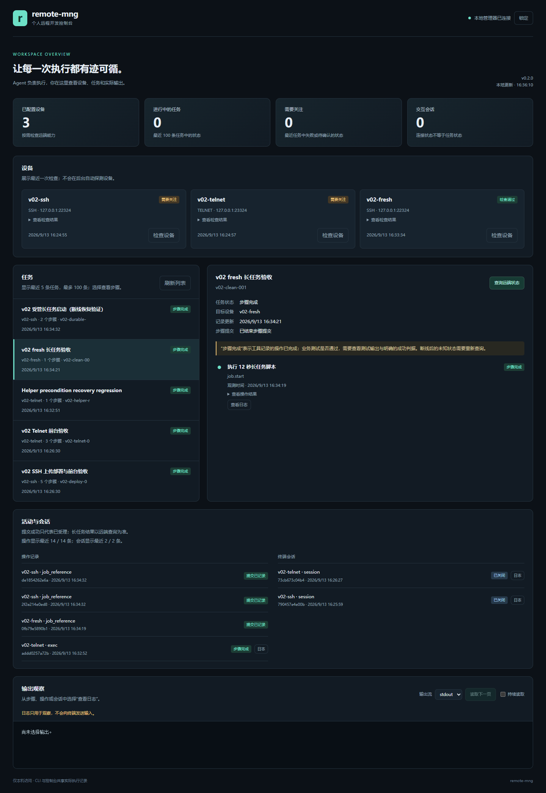

# 0.2 个人试用验证记录

验证日期：2026-09-13。目标是验证 Agent 能否用分发的 CLI/Skill 完成操作、保留证据并从中断恢复，同时让开发者通过本地网页查看同一份状态。

## 测试环境与范围

- 本地 Windows 原生 Python 3.12，WSL Ubuntu/Linux；没有业务测试机或真实嵌入式设备。
- 协议实验使用真实 AsyncSSH、SFTP 和 Telnet 服务，远端命令在 WSL Linux Shell/PTY 中执行。只连接 loopback 和隔离临时目录。
- 使用本机 Claude Code CLI 2.1.218；保留用户现有模型映射，运行时报告 `glm-5.3[1m]`。这不是 Anthropic 模型的独立验证。
- 在源码目录之外新建业务项目，从 wheel 安装工具和随包 Skill。业务项目没有 `CLAUDE.md`、`.claude` 或产品源码；放置同名 Python 文件验证工具不会被业务目录遮蔽。
- Claude 认证、权限配置和全局 Skill 未被实验覆盖。实验使用独立工具目录、Claude 配置目录和 `RMG_HOME`，MCP 配置为空。

## 真实 Agent 部署与前台操作

首轮共 39 次工具调用（含 Skill、读取文件和 Bash），MCP 调用为 0，无权限拒绝。

1. 自动加载 `remote-mng` Skill，执行本地诊断、目标登记、SSH/Telnet 能力检查和个人配方校验。
2. SFTP 上传 910 字节测试包，核对 SHA-256；执行本地提供的部署脚本，取得退出码 0 和 `DEPLOY_OK version=0.2.0-lab`。
3. 分别在 SSH/Telnet 前台检查版本并执行测试，得到 `RESULT PASS; cases=3 failed=0`。
4. SSH 测试首次只观察 0.1 秒，返回 unknown。Claude 使用相同 request-id、输入和匹配条件继续观察，得到 `duplicate=true` 和完成输出；程序计数为 1，证实未重复输入。
5. Telnet 完成后共用程序计数为 2。两边均退出前台并关闭会话。任务档案保存了 5 个 SSH 步骤与 3 个 Telnet 步骤。

测试程序是模拟交互前台。上述结果验证了协议、PTY 和请求语义，不能代表某个真实 CTP 版本及其命令已经适配。

## 实测发现并修复的问题

长任务第一次接入时，Claude 没先检查 helper 就提交作业。缺失 helper 原先返回笼统的 `helper_command_failed`；任务档案保守记录为 unknown，之后重复同一步骤不会重发，Agent 因此做了多次无效尝试。

现在调用 helper 前先检查脚本是否存在且可读。明确未执行时返回 `helper_not_installed`，允许安装 helper 后，以相同任务步骤和作业 ID 再次发起。记录保留拒绝证据及尝试次数。**网络错误、未知响应和旧的笼统错误不因此获得重试权限。** Skill 同时要求首次提交前确认 helper，并明确 `job_not_found` 本身不能证明从未执行。

复查还修正了两项归属判断：`job_id_conflict` 是确定拒绝，失败步骤不能继承已有不同作业的成功状态或取消权；已经确认退出的 `already_left` 结果可以作为幂等退出证据。

修复后的真实 Telnet 回归先故意使用没有 helper 的目标，确认得到 `helper_not_installed`，安装后复用原步骤和 job ID。任务记录 `attempt_count=2`，副作用文件只有一个 `X`，再重复调用没有增加执行次数。

随后给新 Claude 对话一个全新、未安装 helper 的隔离目标。它按更新后的 Skill 先检查、安装并复查 helper，再提交一次 12 秒作业、读取最终日志并 seal 任务。共 19 次工具调用，无错误和权限拒绝；退出码 0，日志含起止标记。

## 管理进程停止后的恢复

对 120 秒作业 `v02-long-001`，检查点确认它为 `running`，且活动普通会话数为 0，随后显式停止本次实验的管理进程。停止响应确认受管作业继续在远端运行，本地运行文件随后消失。

另开 Claude 对话后，仅通过原任务与作业 ID 查询。它先从本地档案看到 unknown，再查询远端状态与 stdout/stderr，并刷新任务记录。9 次工具调用中没有 `job start`：最终 `succeeded`、退出码 0，stdout 47 字节包含 `LONG_JOB_BEGIN` 和 `LONG_JOB_PASS version=0.2.0-lab`，stderr 为空。

首次长任务接入仍属于上文修复前的候选版本，包含 helper 缺失后的无效重试；保留这次失败经历，不能把全部实测描述为首次即成功。新对话恢复与随后全新目标的检查流程分别验证。

## 自动测试与分发检查

最终代码的完整测试：

| 环境 | 结果 |
| --- | --- |
| Windows 原生 | 261 passed，27 skipped |
| WSL Ubuntu/Linux | 288 passed |

Windows 跳过项目主要依赖 Linux `/proc`、Shell helper 或平台特定进程行为，已在 WSL 执行。测试覆盖任务归属、重复请求、前置条件修复、断线未知结果、日志轮转、认证边界、配方路径及真实 SSH/Telnet/SFTP。Ruff、Skill 格式检查、CLI 文档示例检查均通过。

以上是功能与回归验证，不是 Agent 成功率的统计估计，也没有替代真实设备试用。运行时的实际依赖以锁文件和安装环境为准。

控制台使用 Chrome 152 对真实安装环境的管理进程验证：任务摘要、详情、显式远端刷新、关联作业日志、访问凭据从地址移除及 390px 布局均通过，无页面错误。另有自动测试验证认证边界、取消范围及日志作为文本显示。分发包检查确认 Skill 的 7 个文件、网页的 3 个文件、MIT 许可证及文档均随包包含，测试状态和密钥目录未打包。

下面是同一组实验记录的真实页面，选中的是更新 Skill 后一次提交成功的任务。目标名称和数据均来自受控实验，并非用户业务设备。

机器可读的脱敏汇总见 [v02-evidence.json](v02-evidence.json)。

## 可保证的范围

- Task 的 `succeeded / steps_completed` 表示记录步骤完成，业务通过由 Agent 根据项目规定的版本、退出码和测试输出判断。
- 同一前台请求只避免重复发送；不恢复网络断开或管理进程退出后丢失的普通交互终端。
- 断线后查询依赖远端 Linux helper 和保存的作业记录，远端断电或重启不会自动续跑脚本。
- 本地日志可保留最新内容并报告游标缺口；远端作业日志尚未增加配额或自动清理。
- 网页默认轮询本地记录；查询远端作业状态和跟随远端日志分别由明确操作开启。普通 exec 的输出在命令结束后可见。
- 个人配方只校验文件和生成步骤参数，不自动执行，也不替代项目构建系统。

原始终端事件、密钥、控制令牌和临时路径保留在被 Git 忽略的测试目录。仓库只发布脱敏汇总和不含认证信息的页面截图。
